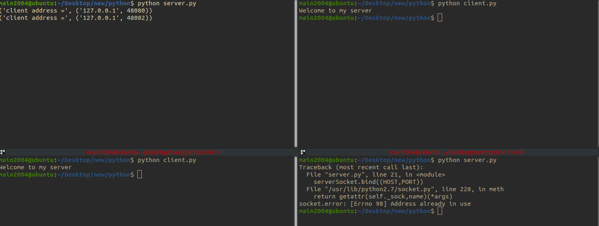

# __Network Socket__ 

<br/>

##### __*Only basic and required information about each topic is explained, please follow the link in __```Further Reading``` section__ to dig deeper*__

<br/>

>### What is network socket?

<br/>

The very formal explanation or definition is : <br/>
A network socket is one endpoint of a two way communication link between two programs running on the network. 

<br/>

So before we try to understand what network socket is, we need to understand some terms.(IP, PORT)
<br>

As you have reached so far to learn about network sockets, you might be familiar with IP and port. Anyway we will have a look at what IPs and PORTs are in order to understand Network sockets more precisely.

IP : <br>
IP address is a label given to each computer to identify them individual. 

PORT : <br>
There are many application and services running in computer which is trying to access the internet, each of these application is given a different port number to identify them individually. 

In simple term IP and PORT can be compared to a telephone number. A telephone number has a area code followed by a number(eg: 044-4565432). The area code(044) is used to identify which area the number belongs to and the followed by number(4565432) is used to identify the specific person/home it belongs to. Same way IP is like area code which is used to identify the computer and PORT is like the followed by number which is used to identify the specific application.

As we learned about [HTTP](./Hypertext%20Transfer%20Protocol.md) earlier, HTTP has a standard port of 80 so usually when you visit a web site it always connected to the PORT at ```80```. These days since almost every website use ```HTTPS```, the PORT is usually 443. 

Like wise each software has it's own PORT to identify which data is for itself. And each application have unique PORT number.

<br/>

Example: <br/>
##### ```replace github.com with 140.82.113.3 for IP``` <br>
When you access  ```https://github.com```, it connects to port 443. You can connect in this way tpp ```https://github.com:443```. Or you can try ```http://github.com:80```, since https is implemented it automatically redirects to __https__. If you try any other port like ```https://github.com:55``` or ```http:///github.com:45```, the connection will be failed. This is simply because HTTP is directed to use port 80(which is redirected to port https) or in other words https is directed to use port 443.

So, if you are confused why github.com? why not a IP address in this place? This is well explained in [DNS](./Domain%20Name%20System.md).

Now let's get started with Network socket.

The above example is more than enough to understand what a socket is. As per the standard definition ```A network socket is one endpoint of a two way communication link between two programs running on the network.``` 
```https://github.com:443``` is a __socket address__ . So __socket__ is the way it reaches the endpoint ```https://github.com:443```.

Ok, If that seems confusing, here is a _[Stack overflow](https://softwareengineering.stackexchange.com/questions/171734/difference-between-a-socket-and-a-port/171738#171738)_ explanation of the same
>Think of your machine as an apartment building:
- A port is an apartment number.
- A socket is the door of an apartment.
- An IP address is the street address of the building.

Now, let's try to understand this with a simple python program.

So if you don't understand python, no worries it will be covered in later [section](./../Hands%20On/Learn%20the%20basics%20of%20a%20scripting%20language.md). For now I will try to break the program and explain you well.

This is a simple server and client program in python, the server listens to the incoming requests and send a message to the client who establishes a connection with the server.

[Server.py](./server.py) <br>

[Client.py](./client.py)

Please try the above program and understand who it works.



From the above image you can see first Shell (_top left_) listens for the incoming requests and displays the IP and PORT of the client.

second shell (_top right_) and third shell (_bottom left_) are client who successfully established a connection and displayed the message that they received for. the server. 

Finally the fourth shell (_bottom right_), here server program is made to run with same IP and port number. Since the port is already assigned, it cannot be used again.

From the first Shell (_top left_) each request is a socket.