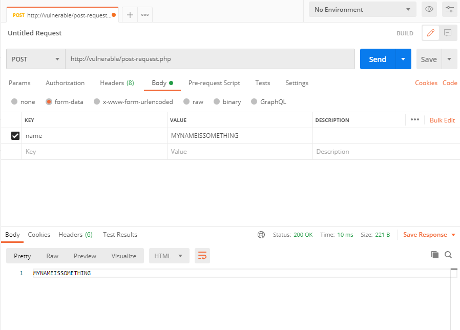

# _Create a page that sends data to itself using a POST request._

---

<br />

Since we know how to work with a GET requests, now it will be pretty easy to work with POST requests.

> Why post

- When we have to send some sensitive information to the server it is always not safe and also not recommended to use GET method, instead we can use POST method. (In GET the information is shown in plain text in URL)
 
- In GET we can only send 2048 characters. So POST can be used since it doesn't have any limit.


> Working

(Here we can't send a request in the URL as we did previously in the GET method.)

- First we will create a PHP which will handle the POST request.

```
<?php 
 
  $name = $_POST['name'];
  echo $name; 

?>
```

The above program will get the value of the key (_name_) which will be present in the body of the request. 

- Then we need to make a request to the above PHP file with POST method.

- So, we will create a simple html file which will submit a form with POST method.

```
<html>
  <body>
    <form action="post_request.php" method="POST">
      NAME : <input type="text" name='name'> <br>
      <input type="submit">
    </form>
  </body>
</html>
```

Instead you can use some software like POSTMAN:



Here you need to make a POST request with a key and value in the body.